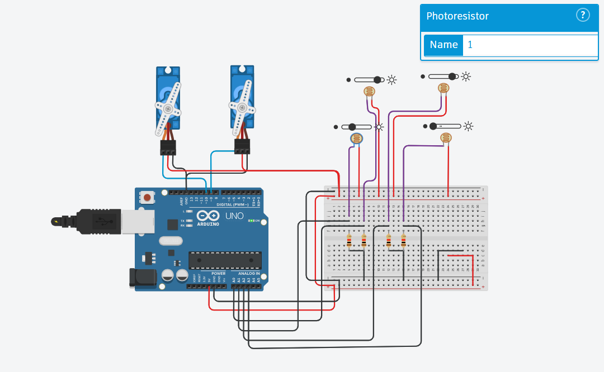

# 🌞 LDR-Servo-Tracker
This project demonstrates a light-tracking system built with Arduino, LDR (Light-Dependent Resistor) sensors, and servo motors. The system detects the direction of a light source and adjusts the servos accordingly, simulating a solar tracker or automated spotlight system. It provides a hands-on example of sensor-based feedback control, making it ideal for IoT or robotics applications that interact with the environment in real-time.

# ✨ Features
Precise Light Detection: Four LDR sensors arranged to capture light direction for accurate tracking.
Servo-Controlled Pan-Tilt Movement: Dual-axis movement with two servo motors enables both horizontal and vertical tracking.
Adaptive Sensitivity: Adjustable tolerance and delay settings for stable, smooth movements without overreacting to sudden light changes.
Arduino-Powered: Utilizes Arduino Uno’s analog inputs for sensor data and PWM outputs for servo control, providing easy customization.
## 📸 Output

# 🧩 Components
Arduino Uno: Microcontroller to process sensor data and control servo movements.
LDR Sensors: Four light sensors for detecting light intensity from different directions.
Servo Motors: Two servos for X (left-right) and Y (up-down) axis movement.
Breadboard & Jumper Wires: For easy prototyping and connecting components.
# 🚀 Usage
Upload the Code: Use the Arduino IDE to upload the provided code to your Arduino Uno.
Simulate or Test: Run the setup in a simulator (like Tinkercad) or on physical hardware to see the light-tracking behavior.
Adjust Settings: Fine-tune sensitivity and delay settings to match your environment and light conditions.
# 🛠 Applications
This project can be adapted for a variety of real-world uses:

🌞 Solar Tracking Systems: Efficient solar panels that follow sunlight for maximum exposure.
💡 Automated Lighting Systems: Lights that follow user movement or environmental changes.
🤖 Introductory Robotics and IoT Projects: Great for beginners learning about feedback control and environmental interaction.
🌍 Environmental Monitoring Systems: Responsive setups that track environmental changes in real-time.
📸 Project Schematic

# 🎛 Customizable Settings
Tolerance: Adjust sensitivity to control how quickly the servos react to light.
Delay: Set delay times for smooth movement.
This project can serve as a foundational prototype for students, hobbyists, and developers exploring IoT, robotics, and environmental interaction systems.

Happy Tracking! 🌞
